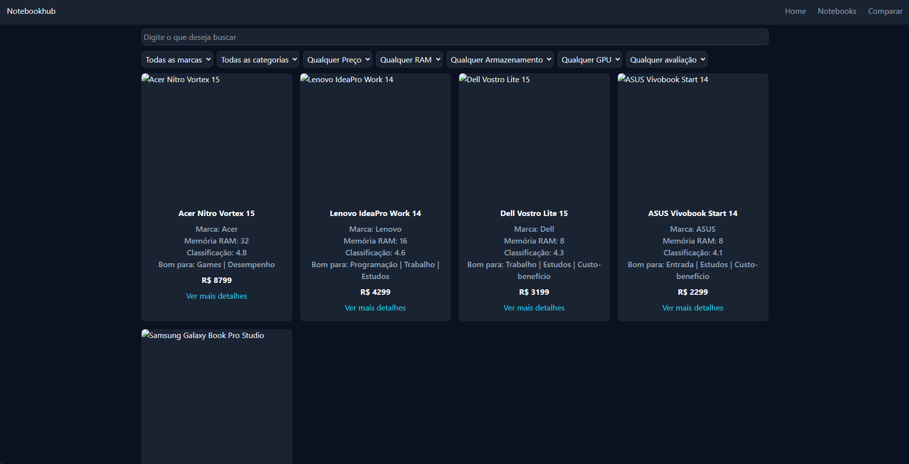
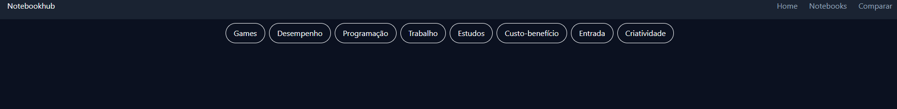

# 💻 NotebookHub

Aplicação web para pesquisa, comparação e recomendação de notebooks — ajudando o usuário a encontrar o modelo certo para sua necessidade e orçamento, sem precisar entender de hardware.



## 🎯 Sobre o projeto

O NotebookHub é um MVP frontend que permite:

- Pesquisar notebooks por nome
- Filtrar por marca, categoria, faixa de preço, RAM, armazenamento, fabricante de GPU e avaliação (combináveis entre si)
- Navegar por categorias de uso (Games, Programação, Trabalho, Estudos, Custo-benefício...)
- Visualizar detalhes completos de cada notebook: descrição, especificações técnicas, prós e contras
- Ver mensagens claras quando nenhum resultado é encontrado



Todos os dados são mockados localmente — não há backend nem preços/produtos reais.

## 🛠️ Stack

- **React** + **Vite**
- **JavaScript** (sem TypeScript)
- **React Router** para navegação client-side
- **Tailwind CSS v4** com Design System próprio (tokens de cor, tipografia e espaçamento)
- **Lucide React** para ícones

## 🚀 Rodando localmente

```bash
git clone <url-do-repositorio>
cd notebookhub
npm install
npm run dev
```

## 📁 Estrutura de pastas

```
src/
├── components/     # Componentes reutilizáveis (NotebookCard, FilterSelect, EmptyState...)
├── pages/          # Páginas ligadas às rotas (Home, Notebooks, Detalhes, Categoria, 404)
├── data/           # Dados mockados dos notebooks
├── services/       # Funções utilitárias (slugify, filterNotebooks)
├── App.jsx
├── main.jsx
└── index.css       # Tokens do Design System (@theme)
```

## ✅ Funcionalidades implementadas

- [x] Design System (cores, tipografia, espaçamento)
- [x] Layout responsivo com Navbar e Footer
- [x] Listagem de notebooks com grid responsivo
- [x] Roteamento (Home, Notebooks, Detalhes, Categoria, 404)
- [x] Página de detalhes completa
- [x] Busca por nome
- [x] Filtros combináveis (marca, categoria, preço, RAM, armazenamento, GPU, avaliação)
- [x] Estados de interface (vazio)

## 🔜 Roadmap

- [ ] Ordenação de resultados (menor preço, maior avaliação...)
- [ ] Comparador de notebooks
- [ ] Sistema de recomendação por questionário
- [ ] Revisão de acessibilidade e SEO
- [ ] Evolução para full stack (FastAPI + PostgreSQL)
- [ ] Deploy

## 📖 Sobre o processo

Este projeto está sendo construído como estudo prático de Frontend, React e UI/UX — desenvolvido passo a passo, fase por fase, com foco em entender cada decisão técnica e de design, não apenas implementar. Por isso o projeto evolui de forma incremental e documentada por commits organizados por funcionalidade.
